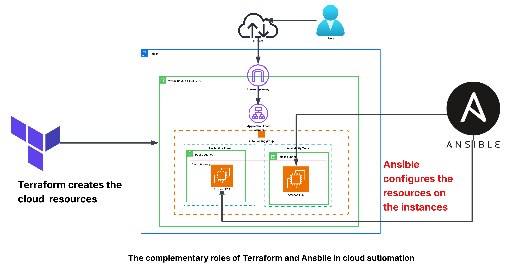
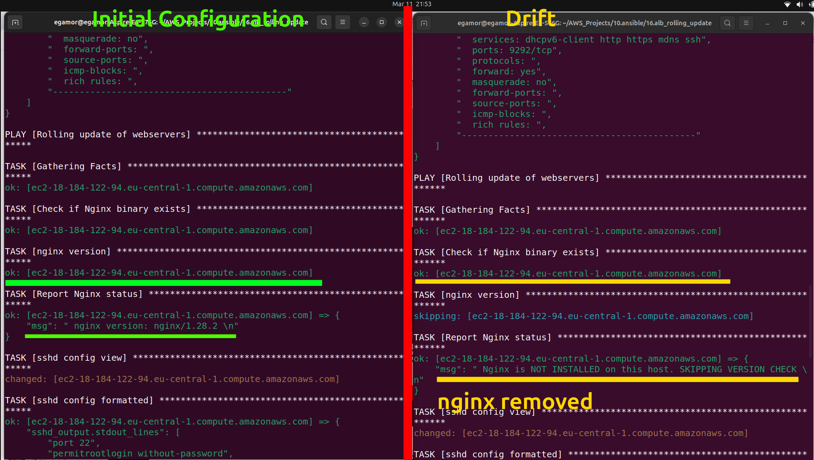
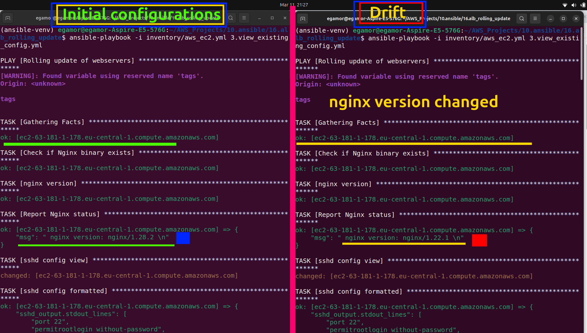
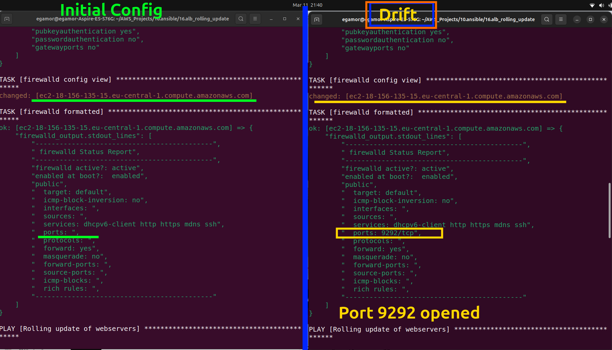
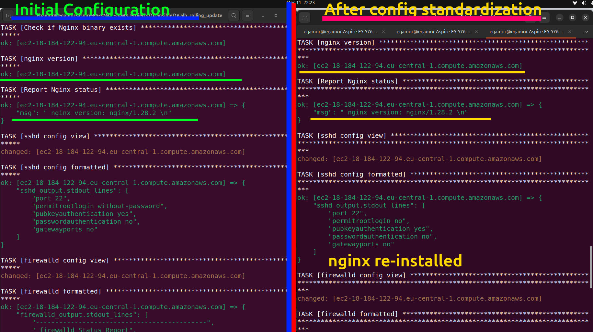
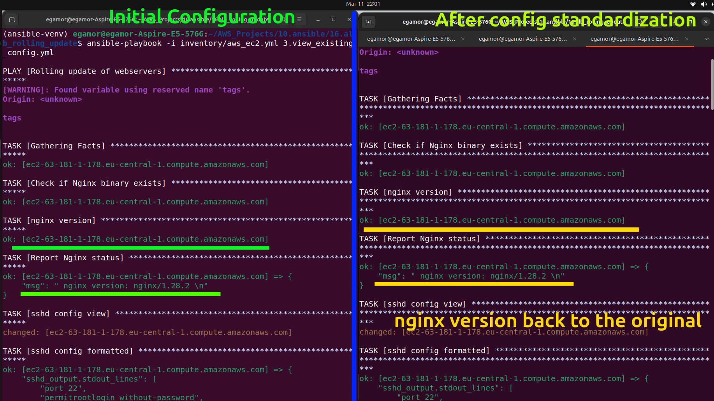
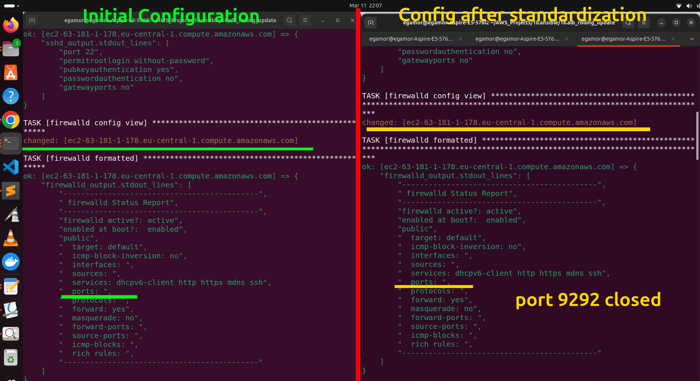

---

# Managing Configuration Drift in AWS using Terraform and Ansible

## Problem Description
In many organizations, engineers work directly on servers to install applications, troubleshoot issues, or make configuration changes. Over time, this can lead to **configuration drift**, where servers that were originally identical begin to differ in their configurations.

For example:
* Some engineers may install **different versions of an application**.
* Others may **open firewall ports** temporarily and forget to close them.
* Certain applications may be **removed or modified** during troubleshooting.

As a result, servers that were originally standardized may begin to behave differently. This introduces several risks:
* **Security vulnerabilities**
* **Unpredictable application behavior**
* **Failed deployments**
* **Difficulty in troubleshooting**
* **Compliance violations**
Configuration drift is extremely common in environments with **multiple servers and multiple administrators**.

---

# Proposed Solution
The solution to configuration drift is **configuration standardization and automation**.
In a small environment, an engineer could manually log into each server and verify:
* Installed packages
* Application versions
* Firewall rules
* System configurations
However, this approach does not scale well.
For example:

| Number of Servers | Manual Effort  |
| ----------------- | -------------- |
| 1                 | manageable     |
| 10                | time consuming |
| 100+              | impractical    |

To solve this scalability problem, **automation tools** are required.
This is where **Ansible** becomes very useful.

---

# Role of Ansible

**Ansible** is a configuration management and automation tool used to enforce consistent system configurations across multiple servers.
It ensures that servers remain in a **desired state**, regardless of any manual changes that may occur over time.
Ansible achieves this using the concept of **idempotency**.
Idempotency means:
* If the required configuration already exists → **Ansible does nothing**
* If the configuration is missing or incorrect → **Ansible fixes it**
For example:
* If nginx should be installed but is missing → Ansible installs it
* If nginx is already installed → Ansible skips installation
This allows safe repeated execution of automation scripts.

---

# Terraform vs Ansible
Although both Terraform and Ansible can interact with cloud resources, they serve **different but complementary purposes**.

### Terraform

Terraform is primarily used for **Infrastructure as Code (IaC)**.
It is responsible for **creating and managing infrastructure resources** such as:
* VPCs
* Subnets
* Security groups
* Load balancers
* EC2 instances
* Auto Scaling Groups

Terraform keeps track of created infrastructure using a **state file**:

```text
terraform.tfstate
```
This file records:
* all created resources
* their current configuration
* dependencies between resources
Terraform compares the desired configuration with the state file to detect changes and maintain infrastructure consistency.
---

### Ansible

Ansible focuses on **configuration management**.
It is responsible for managing the **software and system configuration** inside the servers created by Terraform.

Examples:
* installing applications
* managing application versions
* enforcing firewall rules
* managing system configuration files
* performing security hardening

Unlike Terraform, Ansible **does not maintain a state file**. Instead, it checks the **actual state of the server** each time it runs.

---

# Complementary Roles

Terraform and Ansible are often used together.

A useful analogy:

| Tool      | Role                              |
| --------- | --------------------------------- |
| Terraform | Builds the house                  |
| Ansible   | Furnishes and maintains the house |


Figure 1: Complementary roles of Terraform and Ansible

Terraform creates the infrastructure.
Ansible manages and maintains the systems running on that infrastructure.
Although Terraform can perform some initial configuration using **user_data scripts**, it is not ideal for ongoing configuration management.
This is where Ansible becomes extremely valuable.

---

# Project Goal

The goal of this project is to demonstrate how **Terraform and Ansible can work together to manage configuration drift** in a cloud environment.

In this project:
Terraform is used to create the cloud infrastructure:
* VPC
* Public subnets
* Security groups
* Auto Scaling Group (ASG)
* EC2 instances
During instance creation, the **user_data** field is used to apply initial system configurations.

These configurations include:
* installing nginx
* configuring the firewall
* setting standard application configurations
The architectural overview is shown in Figure 2.


Figure 2: The architectural overview

---


# Step-by-Step Execution

This section explains how to reproduce the project from infrastructure creation to configuration drift remediation.

---

# 1. Terraform Infrastructure Deployment

The infrastructure is deployed in **two phases**:

1. **Foundation infrastructure**
2. **Application infrastructure**

Separating these layers improves modularity and mirrors real-world infrastructure design.

---

## Step 1 — Create the Foundation Infrastructure


First git clone the repository.

```bash
git clone 
```

Navigate to the **foundation infrastructure directory**:

```bash
cd 1.permanent_infra
```

First review the configuration variables.

```bash
terraform.tfvars
```

This file contains project-specific settings such as:

* VPC CIDR
* subnet CIDRs
* availability zones
* project prefix


Initialize Terraform:

```bash
terraform init
```

Preview the infrastructure plan:

```bash
terraform plan
```

Apply the configuration:

```bash
terraform apply
```

This step creates the **core networking infrastructure**:

* VPC
* Public subnets
* Internet gateway
* Security group

These resources form the **foundation network layer** for the project.

---

## Step 2 — Deploy the Application Infrastructure

Next, deploy the infrastructure responsible for running the application servers.

Navigate to the application infrastructure directory:

```bash
cd 2.asg_alb
```

Again review the configuration variables:

```bash
terraform.tfvars
```

Initialize Terraform:

```bash
terraform init
```

Preview the infrastructure plan:

```bash
terraform plan
```

Apply the configuration:

```bash
terraform apply
```

This step creates the following resources:

* Application Load Balancer (ALB)
* Launch Template
* Auto Scaling Group (ASG)
* EC2 instances

Once this step completes successfully, the application servers will be running and accessible through the **load balancer**.

---

# 2. Ansible Configuration Verification

Once the infrastructure is running, Ansible is used to verify and manage the configuration of the EC2 instances.

---

## Step 3 — Discover Instances Using Dynamic Inventory

Because the instances are part of an **Auto Scaling Group**, their IP addresses may change.

To handle this, the project uses the **AWS EC2 dynamic inventory plugin**.

View the discovered instances:

```bash
ansible-inventory -i inventory/aws_ec2.yml --graph
```

This command lists all EC2 instances and groups them based on the inventory configuration.

Next, run the configuration inspection playbook:

```bash
ansible-playbook -i inventory/aws_ec2.yml 1.view_configs_on_all_servers.yml
```

This playbook displays the initial configuration state of each server, including:

* nginx installation status
* nginx version
* firewall rules
* SSH configuration

---

# 3. Introduce Configuration Drift

## Step 4 — Manually Create Configuration Drift

To simulate real-world configuration drift, manual changes are introduced on some servers.

Examples include:

* removing nginx
* installing a different nginx version
* opening unauthorized firewall ports

These actions intentionally deviate from the **approved configuration baseline**.

Below is the drifts introduced and compared with the initial configuration.

### Scenario 1 — Application Removed
Simulate a missing application.

```bash
sudo dnf remove nginx nginx-common -y
```
This creates drift because nginx is expected to be installed.


---
### Scenario 2 — Different Application Version

Install a different nginx version.

```bash
sudo dnf install nginx-1.22.1
```
This creates drift because servers should run a **standardized version**.


---

### Scenario 3 — Unauthorized Firewall Change
Add an unintended firewall rule.

```bash
sudo firewall-cmd --permanent --add-port=9292/tcp
sudo firewall-cmd --reload
```
This creates drift because the port is not part of the approved configuration.



---

# 4. Drift Detection

## Step 5 — Verify the Drift

Run the configuration inspection playbook again:

```bash
ansible-playbook -i inventory/aws_ec2.yml 1.view_configs_on_all_servers.yml
```

The output will now reveal differences between servers, demonstrating the effects of configuration drift.

---

# 5. Configuration Standardization

## Step 6 — Restore the Approved Configuration

Run the remediation playbook:

```bash
ansible-playbook -i inventory/aws_ec2.yml 2.standardize_configs_on_all_servers.yml
```

This playbook restores the standard configuration across all servers by:

* reinstalling missing packages
* enforcing the approved nginx version
* removing unauthorized firewall rules
* applying standardized SSH settings

After execution, all servers return to the **approved configuration baseline**.

---

# 6.  Outcome of standardization

## Step 7 — Confirm Standardization

Run the configuration inspection playbook once more:

```bash
ansible-playbook -i inventory/aws_ec2.yml 1.view_configs_on_all_servers.yml
```

The output should now show that all servers are consistent.

---
Results of remdiation playbook compared to the initial configurations:


After running the Ansible remediation playbook:

**The missing nginx is installed.**


**nginx version is standardized standardized**


**unauthorized firewall rules is removed**

* As such all servers return to the **approved configuration baseline**

---

# 7. Cleanup (Destroy Infrastructure)

After the demonstration is complete, the infrastructure can be removed to avoid unnecessary cloud costs.

First destroy the application infrastructure:

```bash
cd asg_alb
terraform destroy --auto-approve
```

Then destroy the foundation infrastructure:

```bash
cd 1.permanent_infra
terraform destroy --auto-approve
```

All AWS resources created during the project will be removed.

---

✅ This project demonstrates key DevOps principles:

| Concept                       | Description                                                     |
| ----------------------------- | --------------------------------------------------------------- |
| Infrastructure as Code        | AWS infrastructure defined using Terraform                      |
| Configuration Management      | System configurations enforced using Ansible                    |
| Automation                    | Manual configuration tasks replaced with automated workflows    |
| Configuration Drift Detection | Identification of unintended configuration changes              |
| Drift Remediation             | Automated restoration of standardized configurations            |
| Dynamic Infrastructure        | Auto Scaling Group instances discovered using dynamic inventory |

---
## Feedback and Contributions

If you have suggestions for improvements or additional drift scenarios to test, feel free to open an issue or submit a pull request.

Constructive feedback and contributions are always welcome.

---
## 👤 Author

**Eric Gamor**
Terraform | AWS | Cloud Automation
